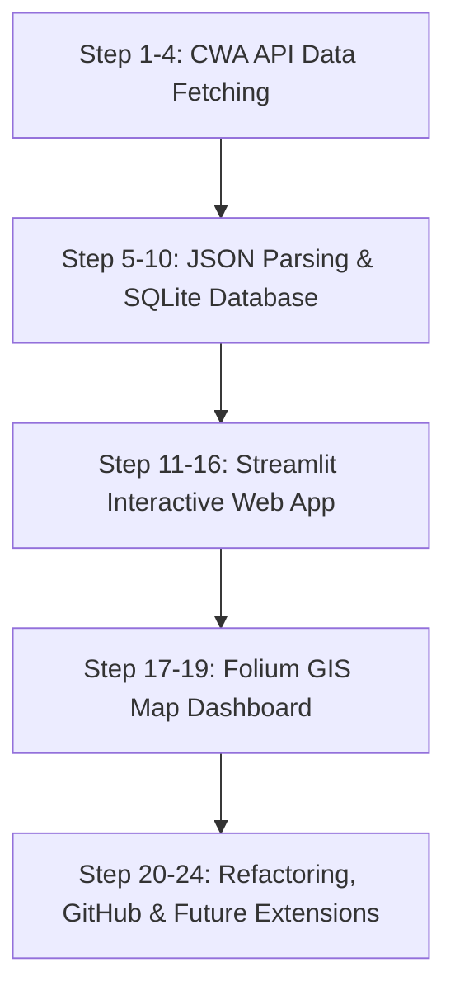

# 🚀 Taiwan Weather Forecast - 24-Step Project Workflow & Implementation Guide

This workflow provides an actionable, step-by-step implementation guide for developers and AI coding agents building the **Taiwan Weather Forecast** system.

---

## 📋 Workflow Execution Summary



---

## 🛠️ Step-by-Step Execution Guide

### Phase 1: Environment Setup & API Data Acquisition (Steps 1 - 4)

#### Step 1: Project Architecture Setup
- Create project directory structure:
  - `fetch_weather.py`: Script for API fetching & SQLite database population.
  - `app.py`: Streamlit Web App interface.
  - `data.db`: SQLite database file (generated automatically).

#### Step 2: Define Domain Requirements
- Goal: Collect temperature forecasts for main regions in Taiwan (Northern, Central, Southern, Eastern, etc.) and present min/max temperature trends.

#### Step 3: Register & Acquire CWA API Key
- Register at the CWA Open Data Portal: `https://opendata.cwa.gov.tw/`
- Generate an API Authorization Key (`CWA-XXXXXXXX-XXXX-XXXX-XXXX-XXXXXXXXXXXX`).

#### Step 4: Write API Ingestion Script (`fetch_weather.py`)
- Implement HTTP GET request using `requests` to fetch weather dataset:
```python
import requests

def fetch_cwa_weather_data(api_key: str):
    url = "https://opendata.cwa.gov.tw/api/v1/rest/datastore/F-C0032-001"
    params = {
        "Authorization": api_key,
        "format": "JSON"
    }
    response = requests.get(url, params=params)
    response.raise_for_status()
    return response.json()
```

---

### Phase 2: JSON Parsing & SQLite Storage (Steps 5 - 10)

#### Step 5: Parse JSON Response Structure
- Inspect the nested structure:
  `data["records"]["location"] -> locationName, weatherElement`

#### Step 6: Extract MinT & MaxT Data Points
- Extract `MinT` (最低溫) and `MaxT` (最高溫) elements for each region and time block:
```python
def extract_temperature_records(json_data):
    records = []
    locations = json_data.get("records", {}).get("location", [])
    for loc in locations:
        region_name = loc.get("locationName")
        elements = loc.get("weatherElement", [])
        
        mint_dict = next((item for item in elements if item["elementName"] == "MinT"), {})
        maxt_dict = next((item for item in elements if item["elementName"] == "MaxT"), {})
        
        mint_times = mint_dict.get("time", [])
        maxt_times = maxt_dict.get("time", [])
        
        for t_min, t_max in zip(mint_times, maxt_times):
            date_str = t_min.get("startTime", "").split(" ")[0]
            min_temp = float(t_min.get("parameter", {}).get("parameterName", 0))
            max_temp = float(t_max.get("parameter", {}).get("parameterName", 0))
            records.append({
                "regionName": region_name,
                "dataDate": date_str,
                "minT": min_temp,
                "maxT": max_temp
            })
    return records
```

#### Step 7: Convert Data to Pandas DataFrame
- Load records into DataFrame for preview and verification:
```python
import pandas as pd

records = extract_temperature_records(json_data)
df = pd.DataFrame(records)
print(df.head())
```

#### Step 8 & 9: Initialize SQLite Database & Table Schema
- Create table `TemperatureForecasts` inside `data.db`:
```python
import sqlite3

def init_db(db_path="data.db"):
    conn = sqlite3.connect(db_path)
    cursor = conn.cursor()
    cursor.execute("""
        CREATE TABLE IF NOT EXISTS TemperatureForecasts (
            id INTEGER PRIMARY KEY AUTOINCREMENT,
            regionName TEXT NOT NULL,
            dataDate TEXT NOT NULL,
            minT REAL NOT NULL,
            maxT REAL NOT NULL,
            UNIQUE(regionName, dataDate) ON CONFLICT REPLACE
        );
    """)
    conn.commit()
    conn.close()
```

#### Step 10: Insert Data & Validate via SQL Queries
- Insert extracted records into SQLite and query results:
```python
def save_records(records, db_path="data.db"):
    conn = sqlite3.connect(db_path)
    cursor = conn.cursor()
    for r in records:
        cursor.execute("""
            INSERT INTO TemperatureForecasts (regionName, dataDate, minT, maxT)
            VALUES (?, ?, ?, ?)
        """, (r["regionName"], r["dataDate"], r["minT"], r["maxT"]))
    conn.commit()
    conn.close()

# SQL Verification Query Example:
# SELECT DISTINCT regionName FROM TemperatureForecasts;
# SELECT * FROM TemperatureForecasts WHERE regionName = '中部地區';
```

---

### Phase 3: Streamlit Web App Interface Development (Steps 11 - 16)

#### Step 11: Streamlit Framework Setup
- Create `app.py` and test basic configuration:
```python
import streamlit as st

st.set_page_config(page_title="Taiwan Weather Forecast", layout="wide")
st.title("🌤️ Taiwan Weather Forecast 看板")
```

#### Step 12: Read Data from SQLite into Streamlit
- Query data from `data.db` using cached function:
```python
import sqlite3
import pandas as pd

@st.cache_data
def load_weather_data(db_path="data.db"):
    conn = sqlite3.connect(db_path)
    df = pd.read_sql_query("SELECT * FROM TemperatureForecasts", conn)
    conn.close()
    return df
```

#### Step 13: Region Selection Dropdown Widget
- Add `st.selectbox` for interactive filtering:
```python
df = load_weather_data()
regions = df["regionName"].unique()
selected_region = st.selectbox("請選擇地區 (Select Region):", regions)
region_df = df[df["regionName"] == selected_region]
```

#### Step 14: Draw Min/Max Temperature Line Chart
- Render trend charts for the selected region:
```python
st.subheader(f"📊 {selected_region} 一週氣溫趨勢 (MinT vs MaxT)")
st.line_chart(region_df.set_index("dataDate")[["minT", "maxT"]])
```

#### Step 15: Present Data Table
- Display tabular data detail:
```python
st.subheader("📋 氣溫數據資料明細")
st.dataframe(region_df[["dataDate", "minT", "maxT"]], use_container_width=True)
```

#### Step 16: Combine into Integrated Web App Interface
- Organize Streamlit page layout into multi-column container dashboards.

---

### Phase 4: Folium Map Visualization & Dashboard Integration (Steps 17 - 19)

#### Step 17: Interactive Taiwan Weather Map (Folium)
- Build Folium map with region markers color-coded by temperature:
```python
import folium
from streamlit_folium import st_folium

def get_temp_color(temp):
    if temp < 20:
        return "blue"
    elif temp <= 25:
        return "green"
    elif temp <= 30:
        return "orange"
    else:
        return "red"

def render_taiwan_map(date_df):
    m = folium.Map(location=[23.7, 121.0], zoom_start=7, tiles="CartoDB positron")
    # Add region markers / polygons based on temperature...
    return m
```

#### Step 18: Date Selector for Map Rendering
- Add `st.selectbox` for dates to update map markers dynamically:
```python
dates = df["dataDate"].unique()
selected_date = st.selectbox("請選擇預報日期 (Select Date):", dates)
date_df = df[df["dataDate"] == selected_date]
```

#### Step 19: Complete Taiwan Weather Dashboard
- Embed Folium map side-by-side with metrics and line charts using `st_folium(m)`.

---

### Phase 5: Optimization, GitHub Deployment & Future Expansion (Steps 20 - 24)

#### Step 20: Code Refactoring & Quality Enhancement
- Modularize functions and wrap database operations in `try-except-finally` blocks.
- Ensure idempotent SQL writes using `UNIQUE(regionName, dataDate) ON CONFLICT REPLACE`.

#### Step 21: GitHub Version Control Setup
- Initialize Git repository: `git init`
- Add `.gitignore`:
  ```
  __pycache__/
  *.db
  .env
  .vscode/
  ```
- Commit and push to GitHub remote repository.

#### Step 22: Practical Extension Ideas
- **LINE Bot Integration**: Webhook service for severe weather/temperature alerts.
- **Tourism & Agriculture Applications**: Crop protection warnings & travel recommendations.
- **AI Analytics**: Integration with OpenAI/Gemini APIs for automatic weather summary text generation.

#### Step 23: Course Recap & Summary
- Key Learnings: API Data Acquisition, JSON Handling, SQLite CRUD, Streamlit Visualization, Folium GIS Map, AI-assisted Coding.

#### Step 24: Continuous Exploration
- Next steps: Expand to Rainfall, UV, and Air Quality (AQI) Open Data APIs to build a multi-domain IoT dashboard!
