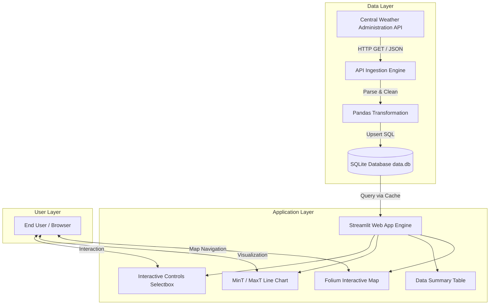
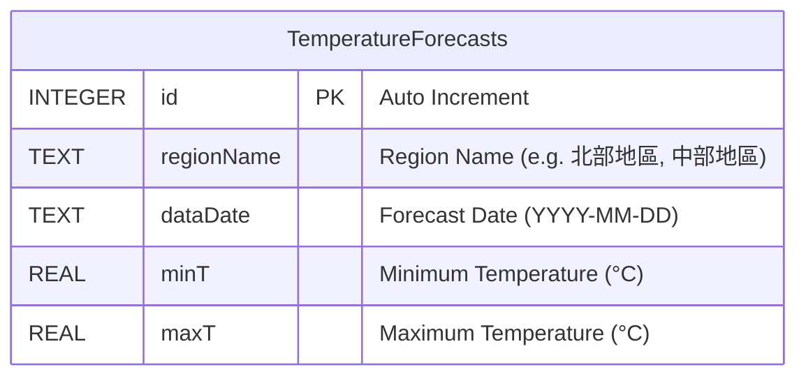
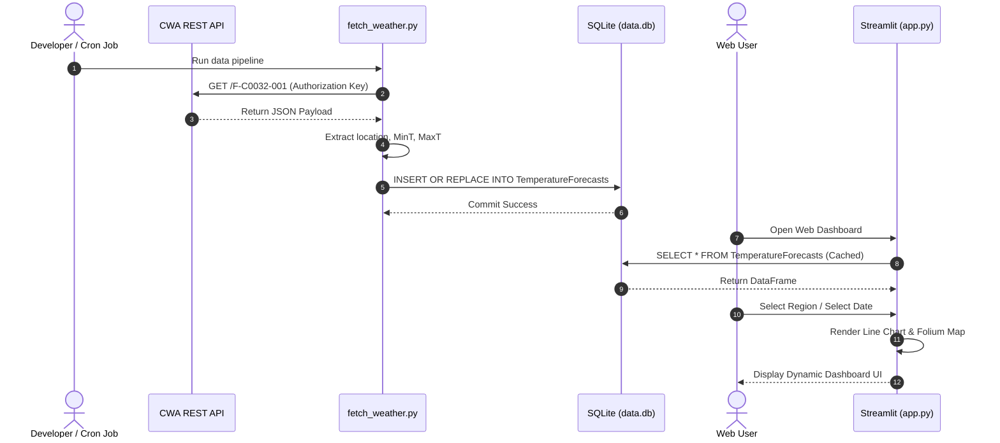

# 🏗️ System Design Documentation: Taiwan Weather Forecast

> **Project Name**: Taiwan Weather Forecast (AI 創新微課程)  
> **Target Audience**: Developers, Data Engineers, AI Architects, and Students  
> **Core Stack**: Python 3.9+ | CWA Open Data API | SQLite 3 | Streamlit | Folium  

---

## 1. System Overview

The **Taiwan Weather Forecast System** is an end-to-end data pipeline and interactive web application designed to fetch, process, store, and visualize weather forecast data across Taiwan regions. 

The system leverages open data provided by the **Central Weather Administration (CWA)** to offer regional temperature analytics, trend forecasting, and interactive GIS heatmaps.



---

## 2. System Architecture

The application adopts a modular, 4-tier layered software architecture:

1. **Ingestion Layer (`fetch_weather.py`)**:
   - Interacts with CWA Open Data API REST endpoints using Python `requests`.
   - Handles network errors, authorization headers, and response status codes.

2. **Persistence Layer (`SQLite 3 - data.db`)**:
   - Stores parsed weather observations and forecasts.
   - Enforces schema integrity and idempotent database insertions.

3. **Data Analytics & Business Logic Layer (`pandas`)**:
   - Transforms JSON payloads into structured DataFrames.
   - Computes daily min/max temperature aggregates per region.

4. **Presentation & GIS Layer (`app.py`)**:
   - Interactive web dashboard built with Streamlit.
   - Geographic visualization powered by Folium and `streamlit-folium`.

---

## 3. Database & Data Model Design

### 3.1 Entity Relationship & Schema Design

The primary entity is `TemperatureForecasts`, which holds temperature forecasts indexed by region and date.



### 3.2 DDL Specification

```sql
CREATE TABLE IF NOT EXISTS TemperatureForecasts (
    id INTEGER PRIMARY KEY AUTOINCREMENT,
    regionName TEXT NOT NULL,
    dataDate TEXT NOT NULL,
    minT REAL NOT NULL,
    maxT REAL NOT NULL,
    UNIQUE(regionName, dataDate) ON CONFLICT REPLACE
);

CREATE INDEX IF NOT EXISTS idx_region_date ON TemperatureForecasts(regionName, dataDate);
```

#### Idempotency & Concurrency Strategy
- **Unique Constraint**: `UNIQUE(regionName, dataDate)` ensures that repeated pipeline executions update existing records rather than creating duplicate entries (`ON CONFLICT REPLACE`).

---

## 4. Sequence & Data Flow



---

## 5. UI/UX & Component Design

### 5.1 Streamlit Dashboard Layout

- **Header Component**: Displays project title, micro-course branding, and last data update timestamp.
- **Filter Controls**:
  - `st.selectbox("地區選擇")`: Filters metrics by region (北部, 中部, 南部, 東部).
  - `st.selectbox("日期選擇")`: Filters GIS map overlays by date.
- **Metric Cards**: Real-time display of average MinT, MaxT, and temperature delta (°C).
- **Line Chart Panel**: Dual-line visualization comparing MinT and MaxT over time.
- **Folium GIS Component**:
  - Color-coded temperature heatmaps:
    - `< 20°C`: Cold (Blue `#1e88e5`)
    - `20°C - 25°C`: Mild (Green `#4caf50`)
    - `25°C - 30°C`: Warm (Yellow/Orange `#ff9800`)
    - `> 30°C`: Hot (Red `#f44336`)

---

## 6. Non-Functional Requirements & Best Practices

1. **Reliability & Error Handling**:
   - API call retries using standard Python `try-except` blocks.
   - Fallback error messages in Streamlit UI if data cannot be fetched or read from `data.db`.

2. **Performance Optimization**:
   - Streamlit caching (`@st.cache_data`) minimizes disk I/O when users interact with UI widgets.
   - Database indexing on `(regionName, dataDate)` accelerates queries.

3. **Extensibility & Future Integrations**:
   - **Line Bot Webhook**: Can easily consume `data.db` to dispatch morning weather alerts.
   - **AI/LLM Integration**: Feeding forecast DataFrames to Gemini/OpenAI API to generate conversational weather summaries.
